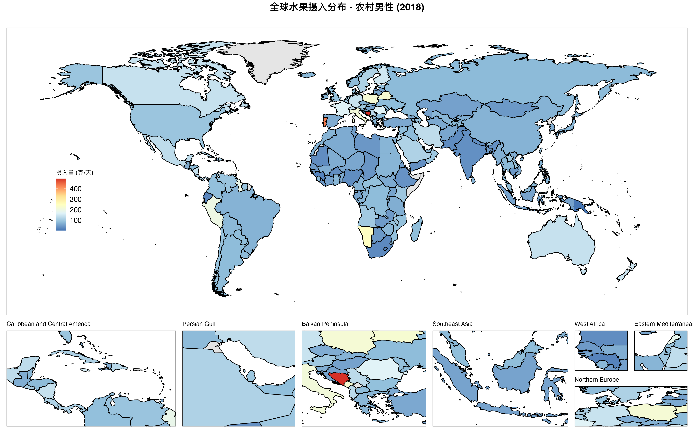
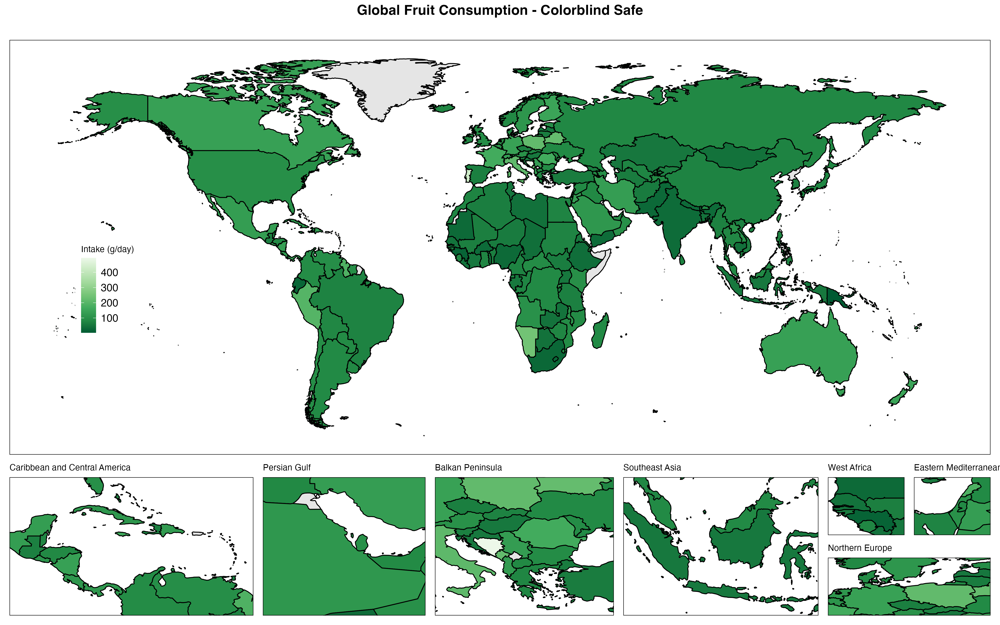
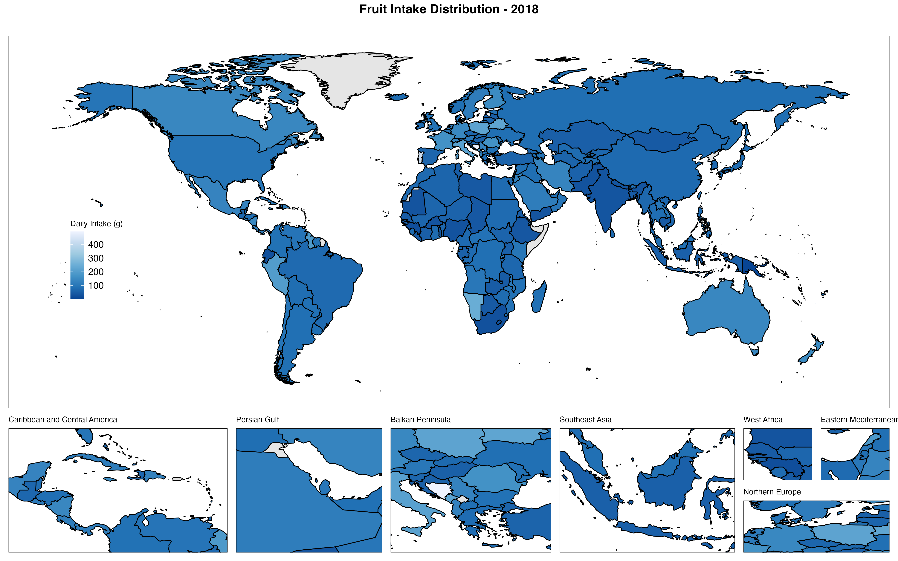
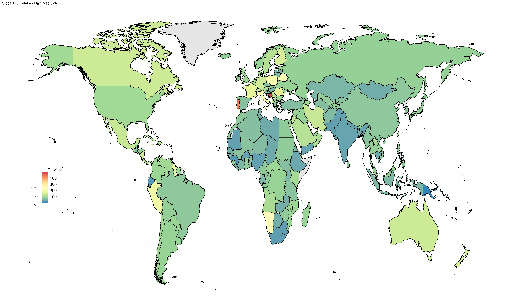
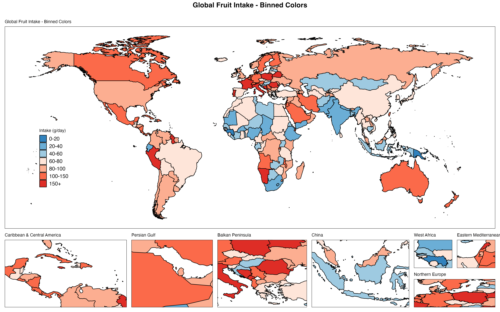
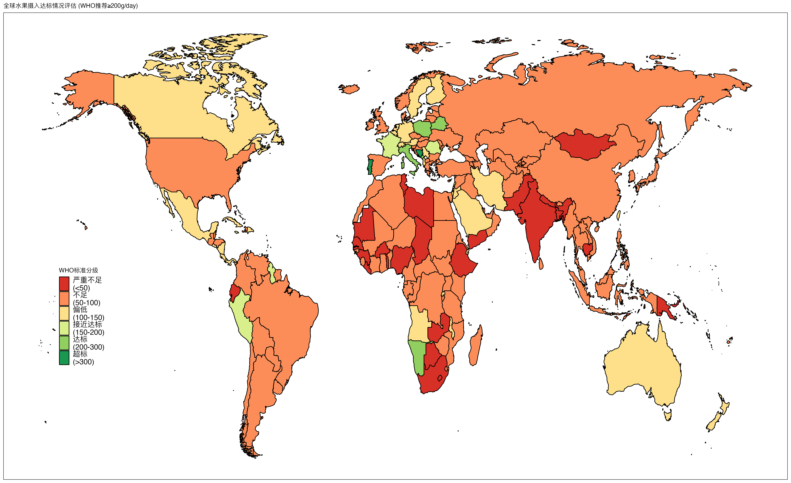
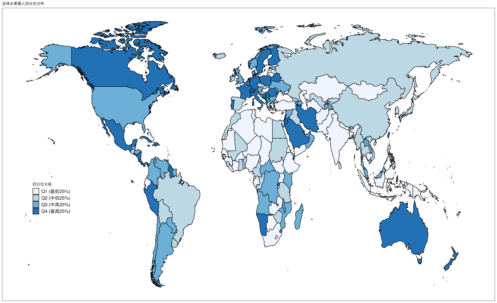
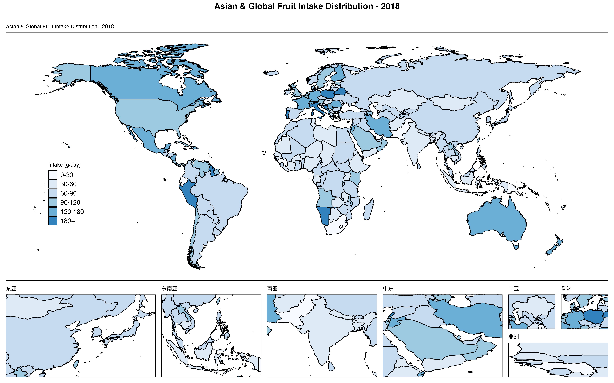

# 第三章地图图片说明

本目录包含第三章《世界地图绘制与GDD数据可视化》生成的所有地图图片。

## 📊 地图清单

### 1. 基础连续配色地图 (图1-5)

#### 图1: Spectral配色世界地图
**文件**: `01_basic_world_map.png`
- 📏 尺寸: 4800 × 3000 像素 (16" × 10", 300 DPI)
- 💾 文件大小: 1.57 MB
- 🎨 配色: Spectral (蓝→黄→红)
- 📊 数值范围: 3.4 - 494.3 g/day
- 🗺️ 地图组成: 1主地图 + 7局部放大区域
- **用途**: 快速开始示例,展示完整功能


---

#### 图2: RdYlBu配色地图
**文件**: `02_rdylbu_palette.png`
- 📏 尺寸: 4800 × 3000 像素 (16" × 10", 300 DPI)
- 💾 文件大小: 1.58 MB
- 🎨 配色: RdYlBu (红→黄→蓝)
- 📊 发散型配色,展示双向差异
- **用途**: 对比分析,政策制定



---

#### 图3: Viridis配色地图
**文件**: `03_viridis_palette.png`
- 📏 尺寸: 4800 × 3000 像素 (16" × 10", 300 DPI)
- 💾 文件大小: 1.51 MB
- 🎨 配色: Viridis (紫→绿→黄)
- 👁️ 色盲友好,印刷友好
- **用途**: 学术发表,无障碍设计



---

#### 图4: Blues配色地图
**文件**: `04_blues_palette.png`
- 📏 尺寸: 4800 × 3000 像素 (16" × 10", 300 DPI)
- 💾 文件大小: 1.53 MB
- 🎨 配色: Blues (浅蓝→深蓝)
- 📈 单向趋势展示
- **用途**: 保护性食物展示



---

#### 图5: 仅主地图(无局部放大)
**文件**: `05_large_map_only.png`
- 📏 尺寸: 6000 × 3600 像素 (20" × 12", 300 DPI)
- 💾 文件大小: 1.69 MB
- 🎨 配色: Spectral
- 🗺️ 仅主地图,无局部放大
- **用途**: 大幅面海报,PPT演示



---

### 2. 分段配色地图 (图6-8)

#### 图6: 自定义分段配色地图
**文件**: `06_binned_color_map.png`
- 📏 尺寸: 4800 × 3000 像素 (16" × 10", 300 DPI)
- 💾 文件大小: 1.50 MB
- 🎨 配色: 蓝色系(低) → 红色系(高)
- 📊 分段: 0-20, 20-40, 40-60, 60-80, 80-100, 100-150, 150+
- **用途**: 快速识别数值区间,分级管理



**分段说明**:
| 区间 | 颜色 | 十六进制 | 含义 |
|------|------|---------|------|
| 0-20 | 深蓝 | #3182BD | 严重缺乏 |
| 20-40 | 中蓝 | #6BAED6 | 缺乏 |
| 40-60 | 浅蓝 | #9ECAE1 | 偏低 |
| 60-80 | 米色 | #FEE5D9 | 中等 |
| 80-100 | 浅橙 | #FCAE91 | 较好 |
| 100-150 | 橙红 | #FB6A4A | 良好 |
| 150+ | 深红 | #DE2D26 | 优秀 |

---

#### 图7: WHO标准分段地图
**文件**: `07_who_standard_map.png`
- 📏 尺寸: 5400 × 3300 像素 (18" × 11", 300 DPI)
- 💾 文件大小: 1.47 MB
- 🎨 配色: 红→黄→绿 (WHO标准)
- 📊 分段: <50, 50-100, 100-150, 150-200, 200-300, >300
- 🏥 WHO推荐: ≥200g/day
- **用途**: 公共卫生评估,政策制定



**WHO分段说明**:
| 区间 (g/day) | 评级 | 颜色 | 政策建议 |
|-------------|------|------|---------|
| <50 | 严重不足 | 深红 #D73027 | 紧急干预 |
| 50-100 | 不足 | 橙红 #FC8D59 | 加强教育 |
| 100-150 | 偏低 | 黄色 #FEE08B | 持续改善 |
| 150-200 | 接近达标 | 浅绿 #D9EF8B | 维持现状 |
| 200-300 | 达标 | 绿色 #91CF60 | 表扬推广 |
| >300 | 超标 | 深绿 #1A9850 | 监测平衡 |

---

#### 图8: 四分位数分段地图
**文件**: `08_quantile_map.png`
- 📏 尺寸: 5400 × 3300 像素 (18" × 11", 300 DPI)
- 💾 文件大小: 1.45 MB
- 🎨 配色: 浅蓝→深蓝 (4级)
- 📊 分段: Q1, Q2, Q3, Q4 (各25%)
- **用途**: 相对排名,区域对比



**四分位数据**:
| 分位 | 范围 (g/day) | 颜色 | 百分位 |
|------|-------------|------|--------|
| Q1 | 3.4 - 63.8 | 浅蓝 #EFF3FF | 0-25% |
| Q2 | 63.8 - 81.4 | 中浅蓝 #BDD7E7 | 25-50% |
| Q3 | 81.4 - 108.2 | 中蓝 #6BAED6 | 50-75% |
| Q4 | 108.2 - 494.3 | 深蓝 #2171B5 | 75-100% |

---

### 3. 自定义局部放大地图 (图9)

#### 图9: 亚洲聚焦局部放大地图
**文件**: `09_asia_focus_map.png`
- 📏 尺寸: 4800 × 3000 像素 (16" × 10", 300 DPI)
- 💾 文件大小: 1.52 MB
- 🎨 配色: 蓝色渐变 (7级)
- 🗺️ 局部放大区域: 东亚、东南亚、南亚、中东、中亚、欧洲、非洲
- **用途**: 区域研究,聚焦特定地理位置



**局部放大区域坐标**:
| 区域 | 经度范围 | 纬度范围 | 主要国家 |
|------|---------|---------|---------|
| 东亚 | 100-145°E | 20-50°N | 中国、日本、韩国 |
| 东南亚 | 95-140°E | -10-25°N | 东盟十国 |
| 南亚 | 60-95°E | 5-35°N | 印度、巴基斯坦 |
| 中东 | 35-60°E | 12-40°N | 伊朗、沙特 |
| 中亚 | 45-85°E | 35-55°N | 哈萨克斯坦等 |
| 欧洲 | 5-25°E | 48-60°N | 北欧国家 |
| 非洲 | -17至-7°E | 7-20°N | 西非国家 |

---

## 🎨 配色方案对比

### 连续配色 vs 分段配色

| 特征 | 连续配色 | 分段配色 |
|------|---------|---------|
| **视觉效果** | 平滑渐变 | 清晰区间 |
| **数据展示** | 细微差异 | 分级管理 |
| **适用场景** | 科研分析 | 政策制定 |
| **识别速度** | 较慢 | 快速 |
| **文件示例** | 图1-5 | 图6-8 |

### 推荐配色组合

| 研究主题 | 推荐配色 | 对应图片 |
|---------|---------|---------|
| 保护性食物 | Greens / Blues | 图4 |
| 风险性食物 | Reds / YlOrRd | - |
| 对比分析 | RdYlBu / Spectral | 图1, 图2 |
| 色盲友好 | Viridis | 图3 |
| 公共卫生评估 | WHO标准 (红→绿) | 图7 |
| 区域排名 | 四分位数 (蓝色系) | 图8 |

---

## 📖 使用建议

### 1. 发表论文
- **推荐**: 图3 (Viridis), 图7 (WHO标准)
- **尺寸**: 7×5英寸, 600 DPI
- **格式**: TIFF or PDF

### 2. 学术海报
- **推荐**: 图5 (仅主地图), 图9 (区域聚焦)
- **尺寸**: 20×12英寸或更大
- **格式**: PNG, 300 DPI

### 3. PPT演示
- **推荐**: 图1 (Spectral), 图6 (分段配色)
- **尺寸**: 10×7.5英寸, 150 DPI
- **格式**: PNG

### 4. 政策报告
- **推荐**: 图7 (WHO标准), 图8 (四分位数)
- **尺寸**: A4纸张适配
- **格式**: PNG or PDF

---

## 🔧 技术参数

### 所有地图共同特征
- ✅ 基于真实GDD数据 (185个国家)
- ✅ 2018年农村男性水果摄入数据
- ✅ 数值范围: 3.4 - 494.3 g/day
- ✅ 使用GlobalDietaryR包生成
- ✅ ggplot2 + sf空间数据处理
- ✅ 高质量PNG格式,300 DPI

### 文件总计
- 📁 图片文件数: 9张
- 💾 总大小: ~13.8 MB
- 📊 覆盖场景: 基础、进阶、高级
- 🎨 配色方案: 6种

---

## 📝 在文档中引用

### Markdown引用格式
```markdown


**图片说明**:
- 📏 尺寸: 4800 × 3000 像素
- 💾 文件大小: 1.57 MB
- 🎨 配色: Spectral
- 📊 数据: 185国,2018年水果摄入
```

### 完整路径
- 相对路径: `../chapter3_maps/01_basic_world_map.png`
- 绝对路径: `/Users/yuzheng/Documents/GDD数据库/文档/chapter3_maps/01_basic_world_map.png`

---

*第三章地图图片集 | GlobalDietaryR包完全教程 | 生成日期: 2025-11-12*
