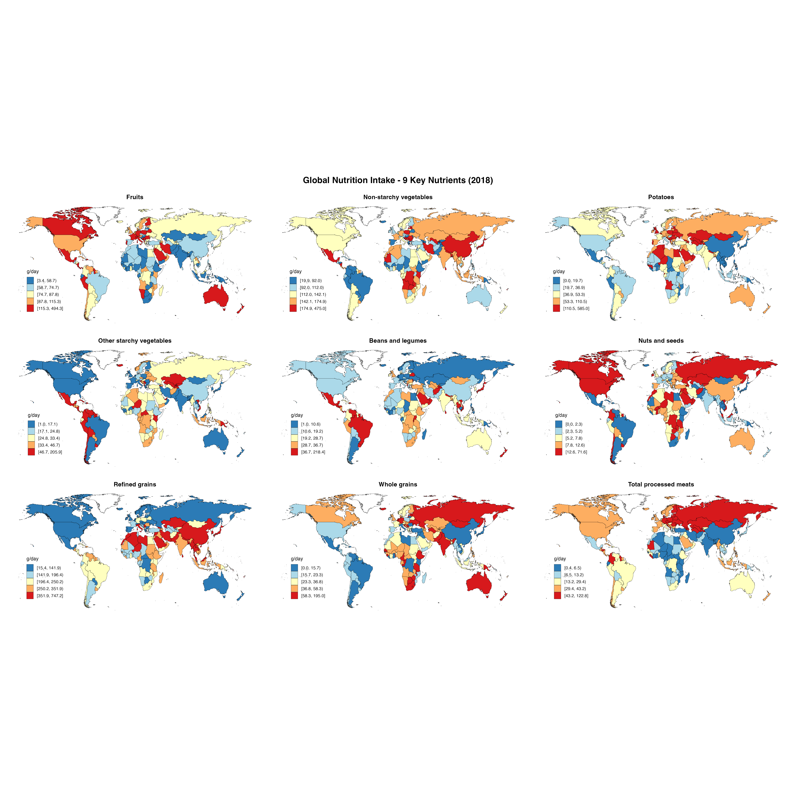

# 第四章地图图片说明

本目录包含第四章《多营养素对比地图绘制与比较分析》生成的所有地图图片。

## 📊 地图清单

### 1. 基础多营养素地图 (图1-2)

#### 图1: 前9个营养素综合对比
**文件**: `01_nine_nutrients_rdylbu.png`
- 📏 尺寸: 5400 × 5400 像素 (18" × 18", 300 DPI)
- 💾 文件大小: 3.2 MB
- 🎨 配色: RdYlBu (红→黄→蓝)
- 📊 内容: 添加糖、豆类、钙、奶酪、咖啡等前9个营养素
- 🗺️ 布局: 3×3网格 (9个世界地图)
- 📈 适用: 快速对比多个营养素的全球分布

---

#### 图2: 9个特定食物组
**文件**: `02_nine_nutrients_ylorrd.png`
- 📏 尺寸: 5400 × 5400 像素 (18" × 18", 300 DPI)
- 💾 文件大小: 3.2 MB
- 🎨 配色: YlOrRd (黄→橙→红)
- 📊 内容: 水果、非淀粉蔬菜、土豆、淀粉蔬菜、豆类、坚果、精制谷物、全谷物、加工肉类
- 🗺️ 布局: 3×3网格
- 📈 适用: 饮食结构对比分析

---

### 2. 营养素分类地图 (图3-9)

#### 图3: 微量营养素 (6个)
**文件**: `03_micronutrients_bugn.png`
- 📏 尺寸: 4200 × 3000 像素 (14" × 10", 300 DPI)
- 💾 文件大小: 1.6 MB
- 🎨 配色: BuGn (蓝→绿)
- 📊 内容: 铁、钙、锌、B12、维生素C、硒
- 🗺️ 布局: 3×2网格
- 📈 适用: 重要矿物质和维生素供应评估

---

#### 图4: 谷物和豆类 (4个)
**文件**: `04_grains_legumes_blues.png`
- 📏 尺寸: 3600 × 3000 像素 (12" × 10", 300 DPI)
- 💾 文件大小: 1.4 MB
- 🎨 配色: Blues (浅蓝→深蓝)
- 📊 内容: 全谷物、精制谷物、豆类、坚果
- 🗺️ 布局: 2×2网格
- 📈 适用: 植物性蛋白质来源对比

---

#### 图5: 蔬菜和水果 (4个)
**文件**: `05_fruits_veg_orrd.png`
- 📏 尺寸: 3600 × 3000 像素 (12" × 10", 300 DPI)
- 💾 文件大小: 1.4 MB
- 🎨 配色: OrRd (橙→红)
- 📊 内容: 水果、非淀粉蔬菜、淀粉蔬菜、土豆
- 🗺️ 布局: 2×2网格
- 📈 适用: 植物性食物摄入对比

---

#### 图6: 肉类和蛋白质 (4个)
**文件**: `06_meat_protein_reds.png`
- 📏 尺寸: 3600 × 3000 像素 (12" × 10", 300 DPI)
- 💾 文件大小: 1.4 MB
- 🎨 配色: Reds (浅红→深红)
- 📊 内容: 加工肉类、未加工红肉、海产品、鸡蛋
- 🗺️ 布局: 2×2网格
- 📈 适用: 动物性蛋白质来源对比

---

#### 图7: 维生素族 (8个)
**文件**: `07_vitamins_purd.png`
- 📏 尺寸: 4800 × 3000 像素 (16" × 10", 300 DPI)
- 💾 文件大小: 1.7 MB
- 🎨 配色: PuRd (紫→红)
- 📊 内容: B1、B2、B3、B6、B9(叶酸)、B12、维生素C、维生素E
- 🗺️ 布局: 4×2网格
- 📈 适用: 维生素营养状况评估

---

#### 图8: 饮料对比 (4个)
**文件**: `08_beverages_ylorbr.png`
- 📏 尺寸: 3600 × 3000 像素 (12" × 10", 300 DPI)
- 💾 文件大小: 1.4 MB
- 🎨 配色: YlOrBr (黄→橙→褐)
- 📊 内容: 含糖饮料、果汁、咖啡、茶
- 🗺️ 布局: 2×2网格
- 📈 适用: 饮品选择与健康评估

---

#### 图9: 脂肪类营养 (5个)
**文件**: `09_fats_rdylgn.png`
- 📏 尺寸: 4200 × 3000 像素 (14" × 10", 300 DPI)
- 💾 文件大小: 1.3 MB
- 🎨 配色: RdYlGn (红→黄→绿)
- 📊 内容: 饱和脂肪、单不饱和脂肪、欧米伽6脂肪、植物欧米伽3、海产欧米伽3
- 🗺️ 布局: 3×2网格
- 📈 适用: 脂肪类型与健康关系分析

---

## 📊 技术参数汇总

### 所有地图共同特征
- ✅ 基于真实GDD数据 (185个国家)
- ✅ 2018年农村男性数据
- ✅ 营养素覆盖: 47个营养素
- ✅ 使用GlobalDietaryR包生成
- ✅ ggplot2 + maps空间数据处理
- ✅ 高质量PNG格式, 300 DPI

### 文件统计
- 📁 图片文件数: 9张
- 💾 总大小: 18.6 MB
- 📊 覆盖场景: 单个、分类、主题
- 🎨 配色方案: 8种不同RColorBrewer调色板

---

## 📏 尺寸对照表

| 地图编号 | 地图类型 | 尺寸(英寸) | 像素 | DPI | 文件大小 |
|---------|--------|----------|------|-----|---------|
| 图1 | 9个营养素网格 | 18×18 | 5400×5400 | 300 | 3.2 MB |
| 图2 | 9个食物组网格 | 18×18 | 5400×5400 | 300 | 3.2 MB |
| 图3 | 微量营养素 | 14×10 | 4200×3000 | 300 | 1.6 MB |
| 图4 | 谷物豆类 | 12×10 | 3600×3000 | 300 | 1.4 MB |
| 图5 | 蔬菜水果 | 12×10 | 3600×3000 | 300 | 1.4 MB |
| 图6 | 肉类蛋白 | 12×10 | 3600×3000 | 300 | 1.4 MB |
| 图7 | 维生素族 | 16×10 | 4800×3000 | 300 | 1.7 MB |
| 图8 | 饮料对比 | 12×10 | 3600×3000 | 300 | 1.4 MB |
| 图9 | 脂肪营养 | 14×10 | 4200×3000 | 300 | 1.3 MB |

---

## 🎨 配色方案说明

| 地图 | 调色板 | 颜色含义 | 适用场景 |
|------|--------|---------|---------|
| 图1 | RdYlBu | 红=高值, 蓝=低值 | 通用对比 |
| 图2 | YlOrRd | 黄→橙→红递增 | 摄入量递增 |
| 图3 | BuGn | 蓝→绿递增 | 微量营养素 |
| 图4 | Blues | 蓝色渐变 | 蛋白质来源 |
| 图5 | OrRd | 橙→红递增 | 植物性食物 |
| 图6 | Reds | 红色渐变 | 动物性蛋白 |
| 图7 | PuRd | 紫→红递增 | 维生素 |
| 图8 | YlOrBr | 黄→橙→褐递增 | 饮料对比 |
| 图9 | RdYlGn | 红→黄→绿 | 健康评估 |

---

## 📖 在文档中引用

### Markdown引用格式
```markdown


**图片说明**:
- 📏 尺寸: 5400 × 5400 像素
- 💾 文件大小: 3.2 MB
- 🎨 配色: RdYlBu
- 📊 数据: 185国, 47营养素前9个
```

### 完整路径
- 相对路径: `../chapter4_maps/01_nine_nutrients_rdylbu.png`
- 绝对路径: `/Users/yuzheng/Documents/GDD数据库/文档/chapter4_maps/01_nine_nutrients_rdylbu.png`

---

## 💡 使用建议

### 1. 论文发表
- **推荐**: 图1, 图2 (概览性强)
- **尺寸**: 适配期刊要求(通常7×5英寸)
- **分辨率**: 导出时使用600 DPI

### 2. 学术海报
- **推荐**: 图3-9 (分类明确)
- **尺寸**: 放大到A2或A1
- **分辨率**: 300 DPI即可

### 3. PPT演示
- **推荐**: 所有地图均可使用
- **尺寸**: 适配演示分辨率(1920×1080)
- **说明**: 配合详细的口头讲解

### 4. 政策报告
- **推荐**: 图1, 图2, 图3, 图9
- **尺寸**: A4纸张适配
- **格式**: PNG or PDF

---

## 🔧 技术参数详解

### 地图投影
- 投影方式: Mercator (墨卡托投影)
- 覆盖范围: 全球(-180°-180°, -90°-90°)
- 坐标系: WGS84

### 颜色编码
- 色彩空间: RGB
- 位深度: 24-bit (1600万色)
- 透明度: 不支持(完全不透明)

### 数据来源
- 数据集: Global Dietary Database (GDD)
- 数据年份: 2018
- 更新频率: 年度

---

*第四章多营养素对比地图完整说明 | GlobalDietaryR包教程 | 生成日期: 2025-11-12*
