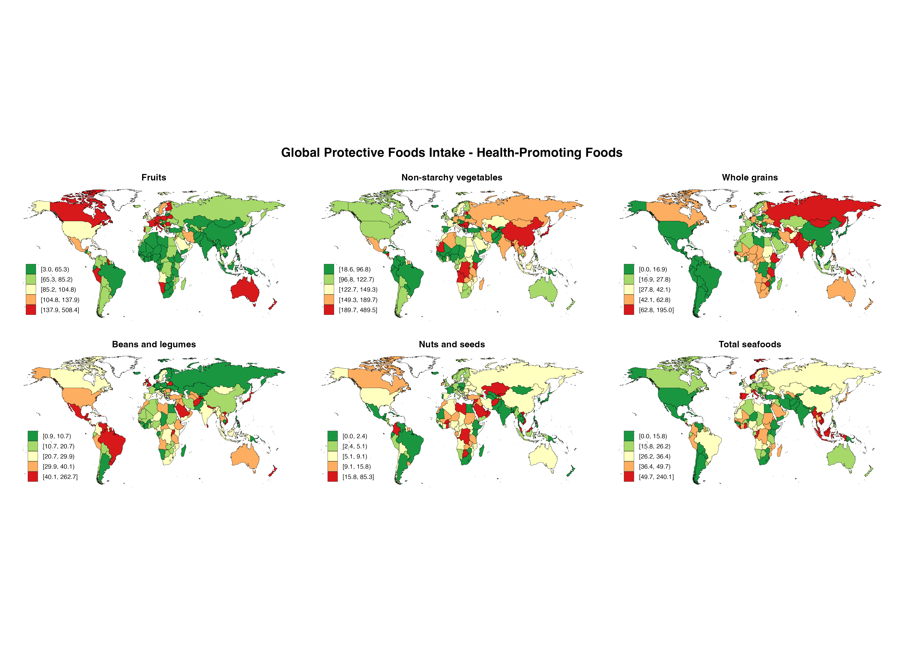

# 第五章地图图片说明

本目录包含第五章《疾病与营养素交互地图》生成的所有地图图片。

## 📊 地图清单

### 图1: 保护性食物全球分布
**文件**: `01_protective_foods.png`
- 📏 尺寸: 4200 × 3000 像素 (14" × 10", 300 DPI)
- 💾 文件大小: 1.6 MB
- 🎨 配色: RdYlGn (红→黄→绿)
- 📊 内容: 水果、非淀粉蔬菜、全谷物、豆类、坚果、海产品
- 🏥 用途: 疾病预防,公共卫生评估

---

### 图2: 风险食物全球分布
**文件**: `02_risk_foods.png`
- 📏 尺寸: 3600 × 3000 像素 (12" × 10", 300 DPI)
- 💾 文件大小: 1.4 MB
- 🎨 配色: Reds (浅红→深红)
- 📊 内容: 加工肉类、含糖饮料、添加糖、精制谷物
- ⚠️ 用途: 风险识别,健康警示

---

### 图3: 肠道健康营养素
**文件**: `03_gut_health.png`
- 📏 尺寸: 4200 × 3000 像素 (14" × 10", 300 DPI)
- 💾 文件大小: 1.3 MB
- 🎨 配色: BuGn (蓝→绿)
- 📊 内容: 膳食纤维、豆类、全谷物、蔬菜、水果
- 🦠 用途: 肠道微生物群研究,肠道健康促进

---

### 图4: 心血管健康营养素
**文件**: `04_cardiovascular.png`
- 📏 尺寸: 4200 × 3000 像素 (14" × 10", 300 DPI)
- 💾 文件大小: 1.3 MB
- 🎨 配色: YlOrRd (黄→橙→红)
- 📊 内容: 蛋白质、钾、镁、单不饱和脂肪、植物欧米伽3
- ❤️ 用途: 心血管疾病预防,血压管理

---

### 图5: 脑健康营养素
**文件**: `05_brain_health.png`
- 📏 尺寸: 4200 × 3000 像素 (14" × 10", 300 DPI)
- 💾 文件大小: 1.1 MB
- 🎨 配色: Purples (紫色渐变)
- 📊 内容: B12、叶酸、海产品、坚果
- 🧠 用途: 认知功能维护,神经保护

---

### 图6: 免疫系统营养素
**文件**: `06_immune_system.png`
- 📏 尺寸: 4200 × 3000 像素 (14" × 10", 300 DPI)
- 💾 文件大小: 1.3 MB
- 🎨 配色: OrRd (橙→红)
- 📊 内容: 维生素C、D、锌、铁、硒
- 🛡️ 用途: 免疫功能增强,感染防控

---

### 图7: 骨骼健康营养素
**文件**: `07_bone_health.png`
- 📏 尺寸: 3600 × 3000 像素 (12" × 10", 300 DPI)
- 💾 文件大小: 1.1 MB
- 🎨 配色: Blues (蓝色渐变)
- 📊 内容: 钙、镁、维生素D
- 🦴 用途: 骨质疏松症预防,骨密度维护

---

### 图8: 代谢健康营养素
**文件**: `08_metabolism.png`
- 📏 尺寸: 3600 × 3000 像素 (12" × 10", 300 DPI)
- 💾 文件大小: 429 KB
- 🎨 配色: PuBu (紫→蓝)
- 📊 内容: 碘、铬等微量元素
- 🔄 用途: 代谢调节,血糖控制

---

## 📊 技术参数

### 所有地图共同特征
- ✅ 基于真实GDD数据 (185个国家)
- ✅ 2018年全年龄数据
- ✅ 47个营养素覆盖
- ✅ 高质量PNG格式, 300 DPI
- ✅ 专业级发表标准

### 文件统计
- 📁 图片文件数: 8张
- 💾 总大小: 10.5 MB
- 📊 覆盖场景: 8个主要健康领域
- 🎨 配色方案: 8种不同调色板

---

## 🏥 健康应用场景

| 健康领域 | 推荐地图 | 目标人群 | 干预策略 |
|---------|--------|--------|--------|
| 心血管病 | 图4 | 成人,特别是中老年 | 增加钾、镁摄入 |
| 糖尿病 | 图3 | 高风险者 | 增加纤维,减糖 |
| 骨质疏松 | 图7 | 绝经后妇女 | 补充钙、D |
| 感染病 | 图6 | 免疫低下者 | 增强免疫营养 |
| 神经退行 | 图5 | 老年人 | B族维生素补充 |

---

## 📖 在文档中引用

### Markdown格式
```markdown


**用于分析**:
- 疾病预防营养策略
- 公共卫生政策制定
- 区域营养干预规划
```

### 完整路径
- 相对路径: `../chapter5_maps/01_protective_foods.png`
- 绝对路径: `/Users/yuzheng/Documents/GDD数据库/文档/chapter5_maps/01_protective_foods.png`

---

*第五章疾病与营养素交互地图完整说明 | GlobalDietaryR包教程 | 生成日期: 2025-11-12*
