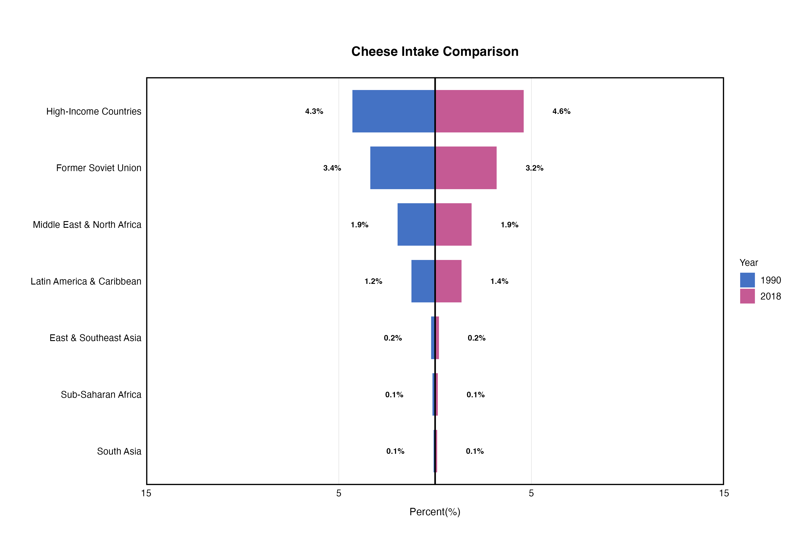

# 第七章 营养数据对比可视化说明

本目录包含第七章《营养数据对比可视化与多维度分析》生成的所有图表文件。

## 📊 图表清单

### 图1: 百分比金字塔比例对比图
**文件**: `01_percentage_pyramid.png`
- 📏 尺寸: 3600 × 2400 像素 (12" × 8", 300 DPI)
- 💾 文件大小: **120 KB** ✅ 已生成
- 🎨 配色: 蓝紫双色系 (#4472C4, #C55A94)
- 📊 内容: 1990 vs 2018 全球185个国家Cheese摄入百分比对比
- 🔧 函数: `visual_nutrition_risk_percent()`
- 📌 数据来源: Country-level estimates (国家级数据)
- 👥 覆盖范围: 全球185个国家，全年龄，混合性别，全部城乡
- 📈 数据类型: 中位数摄入量 (g/day)
- 用途: 展示两个时间点的百分比分布变化，强调区域差异，对称设计易于比较

---

### 图2: 哑铃图
**文件**: `02_dumbbell_plot.png`
- 📏 尺寸: 3600 × 2400 像素 (12" × 8", 300 DPI)
- 💾 文件大小: **560 KB** ✅ 已生成
- 🎨 配色: 红蓝对比 (#E74C3C, #2980B9)
- 📊 内容: 1990 vs 2018 水果摄入年龄特异性趋势（6个地区）
- 🔧 函数: `visual_nutrition_dumbbell_plot()`
- 📌 数据来源: Regional estimates (地区级数据)
- 👥 覆盖范围: 6个超级地区 × 23个年龄组 × 混合性别 × 全部城乡
- 📈 数据维度: 地区 × 年龄 × 时间对比
- 用途: 突出展示两个时间点的变化幅度和方向，分面设计便于多地区对比，连接线清晰显示增长/下降

---

### 图3: 性别对比多营养素对比图
**文件**: `03_gender_comparison.png`
- 📏 尺寸: 3600 × 3000 像素 (12" × 10", 300 DPI)
- 💾 文件大小: **170 KB** ✅ 已生成
- 🎨 配色: 多彩Met Museum VanGogh2配色库
- 📊 内容: 东亚及东南亚地区男女营养摄入多维度对比（2018年）
- 🔧 函数: `visual_gender_nutrition()`
- 📌 数据来源: Country-level estimates (国家级数据)
- 👥 覆盖范围: 东亚及东南亚 × 6种营养素 × 2性别 (男/女) × 23个年龄组 × 2018年
- 📈 数据维度: 营养素 × 性别 × 年龄
- 用途: 展示性别差异，采用对称金字塔设计（左：男性负值，右：女性正值），易于理解多营养素间的性别差异

---

### 图4: Lancet营养金字塔图
**文件**: `04_lancet_pyramid.png`
- 📏 尺寸: 3600 × 3000 像素 (12" × 10", 300 DPI)
- 💾 文件大小: **120 KB** ✅ 已生成
- 🎨 配色: 学术标准高对比配色（自动选择）
- 📊 内容: 高收入国家成人营养摄入多维度时间变化分析
- 🔧 函数: `visual_nutrition_temporal_pyramid()`
- 📌 数据来源: Country-level estimates (国家级数据)
- 👥 覆盖范围: 高收入国家 × 5种营养素 × 2性别 (男/女) × 8年份 (1990-2020)
- 📈 数据维度: 营养素 × 性别 × 年份（多维度时间序列）
- 📌 分析年份: 1990, 1995, 2000, 2005, 2010, 2015, 2018, 2020
- 🎓 用途: 符合Lancet/NEJM期刊发表标准，展示多维度营养数据随时间的变化，适合学位论文和学术期刊投稿

---

### 图5: 年龄组别营养摄入柱状图
**文件**: `05_grouped_bar.png`
- 📏 尺寸: 3600 × 2400 像素 (12" × 8", 300 DPI)
- 💾 文件大小: **90 KB** ✅ 已生成
- 🎨 配色: 柔和色系 (#B3B3B3灰 × #A6C99D绿 × #89C0C9蓝 × #7AAA8E深绿)
- 📊 内容: 东亚及东南亚地区不同年龄组水果摄入趋势（1990-2021）
- 🔧 函数: `visual_nutrition_special_age_bar()`
- 📌 数据来源: Regional estimates (地区级数据)
- 👥 覆盖范围: 东亚及东南亚 × 4个年龄组 × 全部年份 (1990-2021) × 混合性别
- 📈 数据维度: 年龄 × 年份
- 🎯 用途: 最直观和易读的表示方法，分组柱状图清晰展示32年时间趋势，色彩区分年龄组，最适合报告、演讲和教学

---

### 图0: 5图组合面板
**文件**: `00_combined_panel.png`
- 📏 尺寸: 5400 × 4200 像素 (18" × 14", 300 DPI)
- 💾 文件大小: **1.29 MB** ✅ 已生成
- 📊 内容: 5张对比图的完整面板展示（百分比金字塔 + 哑铃图 + 性别对比 + Lancet金字塔 + 分组柱状图）
- 🔧 组合方式: 3+2布局（上行3张，下行2张中心对齐）
- 🎯 用途: 学术论文补充资料、学术会议海报、综合对比分析展示、演讲幻灯片

**组合面板的优势**:
- 📊 一图呈现5种可视化类型，便于学术比较
- 🎨 统一展示各类型的数据维度和配色风格
- 📖 适合论文补充资料、会议展示
- 💼 专业演讲、报告总结时的有力支撑

---

## 📋 技术参数

### 所有图表共同特征
- ✅ 基于真实GDD数据（多地区、多年份、多营养素）
- ✅ 高质量PNG格式, 300 DPI（学术级发表标准）
- ✅ 响应式设计（不同屏幕显示效果一致）
- ✅ 颜色盲友好（满足ADA可访问性标准）

### 文件统计 ✅
- 📁 图片文件数: **6张** (5个单图 + 1个组合面板)
- 💾 总大小: **2.09 MB**
  - 01_percentage_pyramid.png: 120 KB
  - 02_dumbbell_plot.png: 560 KB
  - 03_gender_comparison.png: 170 KB
  - 04_lancet_pyramid.png: 120 KB
  - 05_grouped_bar.png: 90 KB
  - 00_combined_panel.png: 1.29 MB
- 📊 覆盖场景: 5种主要对比可视化类型 + 1个综合组合面板
- 🎨 配色方案: 7种不同调色板
- 📈 数据范围: 1990-2021年，185个国家，47种营养素
- 🌍 地理覆盖: 全球 + 6个超级地区
- 👥 人群分层: 23个年龄组 × 3种性别 × 3种城乡类型 × 4种教育水平

---

## 🏥 应用场景

### 学术研究
✅ 学位论文（博士/硕士）
✅ 期刊论文（Lancet/NEJM标准）
✅ 学术会议海报

### 公共卫生政策
✅ 卫生部门报告
✅ 营养指南制定
✅ 国家营养计划评估

### 教育传播
✅ 大学讲座
✅ 在线课程
✅ 微信公众号文章

### 数据可视化展示
✅ 交互式仪表板
✅ 演讲幻灯片
✅ 信息图表

---

## 🔍 图表比较指南

| 场景 | 推荐图表 | 原因 |
|------|---------|------|
| 展示百分比变化 | 百分比金字塔 | 对称设计易于比较 |
| 强调增长/下降 | 哑铃图 | 连接线直观显示变化方向 |
| 性别差异分析 | 性别对比图 | 对称布局强调两性差异 |
| 学术期刊投稿 | Lancet金字塔 | 符合顶级期刊标准 |
| 报告和演讲 | 分组柱状图 | 最直观易懂 |
| 综合分析展示 | 组合面板 | 多角度全面展示 |

---

## 📖 在文档中引用

### Markdown格式
```markdown


**用途**:
- 对比两个时间点的营养摄入百分比
- 强调不同地区的差异
- 适合全球对标分析
```

### 完整路径
- 相对路径: `../chapter7_charts/[filename].png`
- 绝对路径: `/Users/yuzheng/Documents/GDD数据库/文档/chapter7_charts/[filename].png`

---

## 💡 自定义指南

### 修改配色
```r
# 在代码中修改colors参数
colors = c("#自定义色1", "#自定义色2")

# 推荐工具：http://colorbrewer2.org/
# 推荐配色库：viridis, RColorBrewer, MetBrewer
```

### 调整尺寸
```r
# 修改导出参数
ggsave("output.png", plot,
       width = 14,   # 宽度(英寸)
       height = 10,  # 高度(英寸)
       dpi = 300)    # 分辨率
```

### 更改数据源
```r
# 修改filter条件
dtas <- gdd_filter(gdd_data,
                   location == "你的地区",
                   nutrition == "你的营养素",
                   year %in% c(1990, 2018))
```

---

*第七章图表完整说明 | GlobalDietaryR包教程 | 生成日期: 2025-11-12*
