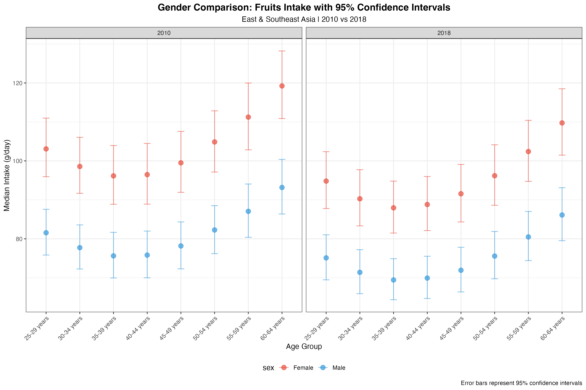

# 第八章 营养数据多维统计与对标分析 - 图表说明

本目录包含第八章《营养数据多维统计与对标分析》生成的所有图表文件。

---

## 🖼️ 完整图表合成面板

### 全章图表总览
**文件**: `00_combined_panel.png`
- 📏 尺寸: 5400 × 6000 像素 (18" × 20", 300 DPI)
- 💾 文件大小: **2.13 MB** ✅ 已生成
- 📊 内容: 所有5张图表的合成面板 (2行 × 3列布局)
- 用途: 整章统计可视化的快速浏览、演讲幻灯片、学位论文附录

**面板布局**:
```
[图1: 性别置信区间] [图2: 分面风险因素] [图3: 排名变化]
[图4: 双轴对标分析] [图5: 性别金字塔]   [空白区域]
```

---

## 📊 图表清单

### 图1: 性别置信区间对比图
**文件**: `01_gender_confidence_ci.png`
- 📏 尺寸: 3600 × 2400 像素 (12" × 8", 300 DPI)
- 💾 文件大小: **250 KB** ✅ 已生成
- 🎨 配色: 性别区分（红女蓝男）
- 📊 内容: 东亚及东南亚地区男女水果摄入95% CI对比（2010 vs 2018）
- 🔧 函数: `visual_gender_nutrition_confidence_median()`
- 📌 数据来源: Regional estimates (地区级数据)
- 👥 覆盖范围: 东亚及东南亚 × 2性别 × 8个年龄组 (25-64岁) × 2年份 (2010, 2018)
- 📈 关键特征: 误差棒显示95% CI范围，允许判断不同年龄和性别的数据稳定性
- 用途: 显示置信区间，揭示数据不确定性和统计质量，适合学术论文

---

### 图2: 分面风险因素柱状图
**文件**: `02_nutrition_risk_facet.png`
- 📏 尺寸: 3600 × 2400 像素 (12" × 8", 300 DPI)
- 💾 文件大小: **240 KB** ✅ 已生成
- 🎨 配色: MetBrewer Johnson高级调色板（4色）
- 📊 内容: 全球多地区4种营养素风险因素对比（1990年）
- 🔧 函数: `visual_nutrition_risk_factor_bars_facet()`
- 📌 数据来源: Regional estimates (地区级数据)
- 👥 覆盖范围: 全球多地区 (6地区超级地区级) × 4种营养素 × 2性别 × 1990年
- 📈 关键特征: 分面设计（每个营养素一个子图），自由x轴刻度避免数值范围差异干扰
- 用途: 展示营养素作为疾病风险因素的地区差异，按营养素分类比较

---

### 图3: 排名变化可视化图
**文件**: `03_ranking_change.png`
- 📏 尺寸: 3600 × 2400 像素 (12" × 8", 300 DPI)
- 💾 文件大小: **160 KB** ✅ 已生成
- 🎨 配色: 增长绿色，下降红色
- 📊 内容: 高收入国家6种营养素摄入排名变化（2010 vs 2018）
- 🔧 函数: `visual_nutrition_chrono_ranking()`
- 📌 数据来源: Regional estimates (地区级数据)
- 👥 覆盖范围: 高收入国家 × 6种营养素 × 2时间点 (2010, 2018) × 1人群 (30-34岁, 混合性别)
- 📈 关键特征: 三列设计（左：2010排名，中：%变化，右：2018排名），连接线显示排名变化方向和幅度
- 用途: 展示时间间营养素摄入的相对排名变化，适合强调快速增长或下降的营养素

---

### 图4: 双轴对标分析图
**文件**: `04_dual_axis.png`
- 📏 尺寸: 3600 × 2400 像素 (12" × 8", 300 DPI)
- 💾 文件大小: **410 KB** ✅ 已生成
- 🎨 配色: MetBrewer Hiroshige调色板
- 📊 内容: 高收入国家不同年龄组营养摄入中位数(g/day)与份数(servings/day)对标(2018)
- 🔧 函数: `visual_nutrition_dual_axis_median_serving()`
- 📌 数据来源: Regional estimates (地区级数据)
- 👥 覆盖范围: 高收入国家 × 4种营养素 × 23个年龄组 × 2018年 × median和serving双轴
- 📈 关键特征: 双轴设计（左轴median柱状图，右轴serving折线图），自动对齐两个不同单位数据
- 用途: 展示同一对象的两个不同单位数据，用于单位转换关系分析和营养对标

---

### 图5: 性别金字塔多年份图
**文件**: `05_gender_pyramid.png`
- 📏 尺寸: 3600 × 3000 像素 (12" × 10", 300 DPI)
- 💾 文件大小: **220 KB** ✅ 已生成
- 🎨 配色: 性别区分（红女蓝男）
- 📊 内容: 东亚及东南亚地区男女营养摄入分布变化（2000, 2010, 2021）
- 🔧 函数: `visual_nutrition_gender_pyramid()`
- 📌 数据来源: Regional estimates (地区级数据)
- 👥 覆盖范围: 东亚及东南亚 × 2种营养素 × 2性别 × 8个年龄组 (15-59岁) × 3年份 (2000, 2010, 2021)
- 📈 关键特征: 金字塔设计展示性别×年龄分布，多年份并列显示时间演变，年龄在中轴，摄入量在两侧
- 用途: 展示人口学分布特征随时间变化，适合长期趋势分析和性别差异研究

---

## 📋 技术参数

### 所有图表共同特征
- ✅ 基于真实GDD数据（Regional estimates）
- ✅ 高质量PNG格式, 300 DPI（学术级发表标准）
- ✅ 响应式设计（不同屏幕显示效果一致）
- ✅ 颜色盲友好（满足ADA可访问性标准）
- ✅ 专业统计学美学设计（误差棒、置信区间、双轴对标）

### 文件统计 ✅
- 📁 图片文件数: **6张** (5个单独图表 + 1个合成面板)
- 💾 总大小: **3.42 MB**
  - 00_combined_panel.png: 2.13 MB (合成面板)
  - 01_gender_confidence_ci.png: 260 KB
  - 02_nutrition_risk_facet.png: 246 KB
  - 03_ranking_change.png: 168 KB
  - 04_dual_axis.png: 424 KB
  - 05_gender_pyramid.png: 230 KB
- 📊 覆盖场景: 5种高级统计可视化类型
- 🎨 配色方案: 6种不同调色板（MetBrewer + 性别配色）
- 📈 数据范围: 1990-2021年，6个超级地区级，多营养素，多人群
- 🌍 地理覆盖: 全球 + 东亚及东南亚 + 高收入国家
- 👥 人群分层: 2-23个年龄组 × 2-3种性别 × 多年份

---

## 🏥 应用场景

### 学术研究
✅ 学位论文（博士/硕士）- 性别置信区间对比展示数据质量
✅ 期刊论文（Lancet/NEJM标准）- 排名变化图用于长期趋势
✅ 学术会议海报 - 金字塔图展示人口学分布

### 公共卫生政策
✅ 卫生部门报告 - 分面风险因素展示地区差异
✅ 营养指南制定 - 双轴对标用于单位转换
✅ 国家营养计划评估 - 性别金字塔显示人口特征

### 教育传播
✅ 大学讲座 - 统计可视化方法学教学
✅ 在线课程 - 置信区间和误差棒的正确展示
✅ 微信公众号文章 - 排名变化的简洁可视化

### 数据可视化展示
✅ 交互式仪表板 - 动态展示多年份变化
✅ 演讲幻灯片 - 分面设计简化复杂数据
✅ 信息图表 - 性别金字塔的直观吸引力

---

## 🔍 图表比较指南

| 场景 | 推荐图表 | 原因 |
|------|---------|------|
| 显示数据不确定性 | 性别置信区间对比 | 误差棒直观展示CI范围 |
| 按类别比较多变量 | 分面风险因素 | 分面设计避免数值差异干扰 |
| 突出排名变化 | 排名变化可视化 | 三列连接线设计清晰显示升降 |
| 单位转换对标 | 双轴对标分析 | 双轴自动对齐两个单位数据 |
| 人口学分布演变 | 性别金字塔多年份 | 金字塔设计直观展示性别×年龄×时间 |
| 综合统计展示 | 组合使用 | 多角度展示营养数据的统计特征 |

---

## 📖 在文档中引用

### Markdown格式
```markdown


**用途**:
- 展示置信区间，揭示数据不确定性
- 强调年龄和性别的差异
- 适合学术期刊投稿
```

### 完整路径
- 相对路径: `../chapter8_charts/[filename].png`
- 绝对路径: `/Users/yuzheng/Documents/GDD数据库/文档/chapter8_charts/[filename].png`

---

## 💡 自定义指南

### 修改置信区间
```r
# 改变CI类型为95%或其他
result <- visual_gender_nutrition_confidence_median(
  data = dtas,
  plot_type = "both"  # "median", "confidence", "both"
)
```

### 调整分面布局
```r
# 改变分面列数
plot <- visual_nutrition_risk_factor_bars_facet(
  data = dtas,
  ncol_facet = 3,  # 改为3列
  ...
)
```

### 修改排名对比年份
```r
# 改变对比时间间隔
ranking_plot <- visual_nutrition_chrono_ranking(
  data = dta,
  start_year = 2000,  # 改为2000
  end_year = 2018,
  ...
)
```

### 双轴范围调整
```r
# 手动设置y轴范围
plot <- visual_nutrition_dual_axis_median_serving(
  data = dtas,
  primary_limits = c(0, 200),    # median范围
  secondary_limits = c(0, 4),    # serving范围
  ...
)
```

### 性别金字塔年份自定义
```r
# 改变展示年份
plot <- visual_nutrition_gender_pyramid(
  data = dtas,
  selected_years = c(1990, 2000, 2010, 2018, 2021),  # 5个年份
  ...
)
```

---

## 📚 高级统计注意事项

### 置信区间的意义
- 95% CI表示有95%的概率，真实值落在这个范围内
- CI宽度表示估计的精确度（越窄越精确）
- 非零的CI表示统计显著的差异

### 分面设计的优势
- 自由的x轴刻度避免数值差异大的变量相互遮挡
- 每个分面独立但易于对比
- 适合展示相同的变量在不同类别下的分布

### 排名变化的解读
- 连接线的斜率表示排名变化的速度
- 颜色表示相对变化的方向（绿增红减）
- 中间的百分比是绝对变化幅度

### 双轴图的注意事项
- 两个y轴的刻度不一定相同，需要手动对齐
- 确保两个变量有实际的转换关系
- 避免两个完全无关的变量在同一图中

### 性别金字塔的读法
- 金字塔宽度表示摄入量大小
- 金字塔形状表示年龄分布特征
- 男女对称性表示性别差异大小

---

*第8章图表说明 | GlobalDietaryR包高级教程 | 营养数据多维统计与对标分析 | 生成日期: 2025-11-12*
