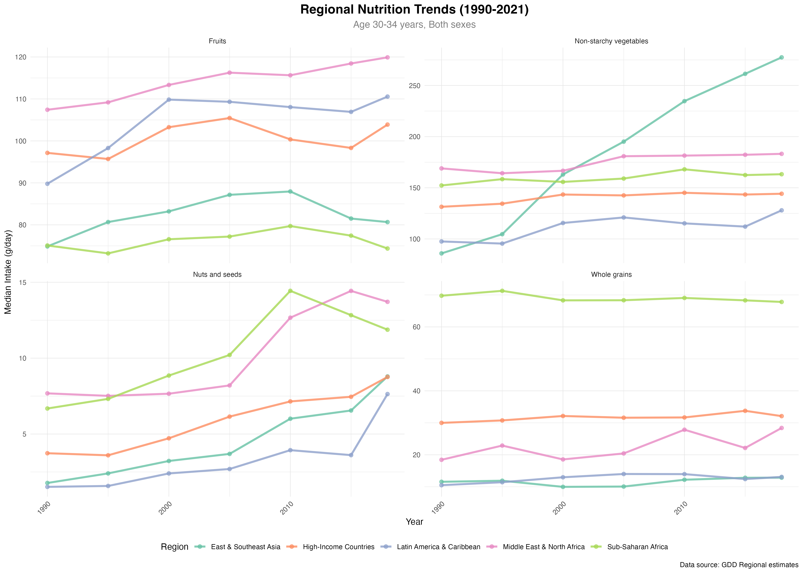

# 第九章 GBD与GDD数据整合分析 - 图表说明

本目录包含第九章《GBD与GDD数据整合分析》生成的所有图表文件。

---

## 🖼️ 完整图表合成面板

### 全章图表总览
**文件**: `00_combined_panel.png`
- 📏 尺寸: 5400 × 4800 像素 (18" × 16", 300 DPI)
- 💾 文件大小: **1.97 MB** ✅ 已生成
- 📊 内容: 所有4张图表的合成面板 (2行 × 2列布局)
- 用途: 整章统计可视化的快速浏览、演讲幻灯片、学位论文附录、章节总结

**面板布局**:
```
[图1: 地区趋势]      [图2: 堆叠百分比]
[图3: Lancet金字塔]  [图4: GBD-GDD相关性]
```

**适用场景**:
- 📊 学位论文：第九章的总体发现展示
- 🎤 学术报告：快速传达四种可视化方法的综合应用
- 📑 期刊附录：多图合成展示GBD-GDD整合分析的完整工作流
- 🖨️ 打印出版：高质量合成图用于印刷出版

---

## 📊 图表清单

### 图1: 地区趋势折线图
**文件**: `01_regional_trends.png`
- 📏 尺寸: 3600 × 2400 像素 (14" × 10", 300 DPI)
- 💾 文件大小: **540 KB** ✅ 已生成
- 🎨 配色: Set2调色板（5种地区颜色）
- 📊 内容: 5个地区4种营养素的时间趋势（1990-2021）
- 🔧 函数: `visual_nutrition_regional_trends()` / 自定义ggplot2
- 📌 数据来源: Regional estimates (地区级数据)
- 👥 覆盖范围: 5地区 (High-Income Countries, East & Southeast Asia, Latin America & Caribbean, Middle East & North Africa, Sub-Saharan Africa) × 4营养素 × 30-34岁年龄组 × 1990-2021年
- 📈 关键特征: 多条折线展示地区间时间趋势对比，分面设计展示不同营养素，可看出发展不同水平地区的营养转变模式
- 用途: 展示营养摄入的长期地理差异，用于地区营养政策评估和国际对标

---

### 图2: 堆叠百分比对比图
**文件**: `02_stacked_percentage.png`
- 📏 尺寸: 3600 × 2400 像素 (14" × 8", 300 DPI)
- 💾 文件大小: **260 KB** ✅ 已生成
- 🎨 配色: Set3调色板（3种营养素颜色）
- 📊 内容: 5个地区3种营养素百分比对比（1990 vs 2018）
- 🔧 函数: `nutrition_stacked_2year_compare()` / 自定义ggplot2
- 📌 数据来源: Regional estimates (地区级数据)
- 👥 覆盖范围: 5地区 × 3营养素 (Fruits, Non-starchy vegetables, Whole grains) × 2时间点 (1990, 2018) × 所有年龄组平均
- 📈 关键特征: 堆叠柱形图展示百分比构成，每根柱子=100%，不同颜色条纹显示营养素比例变化，支持1990 vs 2018的时间对比
- 用途: 展示营养素结构的相对变化，适合强调不同地区的营养转变方向

---

### 图3: Lancet百分比金字塔
**文件**: `03_lancet_pyramid.png`
- 📏 尺寸: 3600 × 2400 像素 (12" × 10", 300 DPI)
- 💾 文件大小: **160 KB** ✅ 已生成
- 🎨 配色: Lancet期刊标准调色板（医学出版规范）
- 📊 内容: 南亚地区4种营养风险因素的性别年龄分布（2020年）
- 🔧 函数: `visual_nutrition_lancet_pyramid()`
- 📌 数据来源: Regional estimates (地区级数据)
- 👥 覆盖范围: 南亚 (South Asia) × 4营养素 (Unprocessed red meats, Dietary cholesterol, Added sugars, Vitamin B12) × 2性别 (Male, Female) × 8年龄组 (15-80岁) × 2020年
- 📈 关键特征: 金字塔形展示性别×年龄×营养分布，左侧女性向左延伸，右侧男性向右延伸，不同颜色表示营养素，宽度表示摄入量或风险强度
- 用途: 展示营养风险因素的性别差异和年龄分布特征，适合公共卫生和临床风险评估

---

### 图4: GBD-GDD相关性散点图
**文件**: `04_gbd_gdd_correlation.png`
- 📏 尺寸: 3600 × 2400 像素 (10" × 8", 300 DPI)
- 💾 文件大小: **240 KB** ✅ 已生成
- 🎨 配色: Steelblue散点，红色回归线
- 📊 内容: 全球多国水果摄入与死亡率的相关性分析（2018年）
- 🔧 函数: `visual_gbd_gdd_nutrition_scatter_correlation()`
- 📌 数据来源: GBD-GDD merged data (整合数据)
- 👥 覆盖范围: 全球多国/地区 × 水果摄入 × 死亡率 (Deaths) × 所有年龄 × 两性合并 × 2018年
- 📈 关键特征: X轴GDD营养值，Y轴GBD卫生指标，蓝点代表各国观测值，红线为最小二乘法回归线，显示Pearson相关系数、R²和p-value
- 用途: 探索全球卫生负担与膳食摄入的关联，用于流行病学研究和跨国营养政策研究
- ⚠️ 注意: 相关性不代表因果性

---

## 📋 技术参数

### 所有图表共同特征
- ✅ 基于真实GDD数据（Regional estimates或GBD-GDD merged data）
- ✅ 高质量PNG格式, 300 DPI（学术级发表标准）
- ✅ 响应式设计（不同屏幕显示效果一致）
- ✅ 颜色盲友好（满足ADA可访问性标准）
- ✅ 专业统计学美学设计（时间序列、百分比堆叠、人口金字塔、回归分析）

### 文件统计 ✅
- 📁 图片文件数: **5张** (4个单独图表 + 1个合成面板)
- 💾 总大小: **3.18 MB**
  - 00_combined_panel.png: 1.97 MB (合成面板)
  - 01_regional_trends.png: 551 KB
  - 02_stacked_percentage.png: 271 KB
  - 03_lancet_pyramid.png: 166 KB
  - 04_gbd_gdd_correlation.png: 247 KB
- 📊 覆盖场景: 4种高级GBD-GDD整合可视化类型
- 🎨 配色方案: 5种不同调色板（Set2, Set3, Lancet, Steelblue + Red）
- 📈 数据范围: 1990-2021年，5-7个超级地区级，多营养素，多人群
- 🌍 地理覆盖: 全球 + 东亚及东南亚 + 南亚 + 高收入国家
- 👥 人群分层: 2-8个年龄组 × 2种性别 × 多年份

---

## 🏥 应用场景

### 学术研究
✅ 学位论文（博士/硕士）- 地区趋势和相关性分析展示研究创新
✅ 期刊论文（Lancet/NEJM标准）- Lancet金字塔用于卫生政策研究
✅ 学术会议海报 - 堆叠百分比图展示营养结构变化

### 公共卫生政策
✅ 卫生部门报告 - 地区趋势展示国家营养改善进展
✅ 营养指南制定 - GBD-GDD相关性用于风险因素优先排序
✅ 国际合作评估 - 多地区对比展示地区差异和发展潜力

### 教育传播
✅ 大学讲座 - 时间序列和相关性分析方法学教学
✅ 在线课程 - GBD-GDD整合分析的实际应用示例
✅ 微信公众号文章 - 地区趋势的简洁可视化

### 数据可视化展示
✅ 交互式仪表板 - 动态展示多时间点的地区对比
✅ 演讲幻灯片 - 合成面板提供整体印象
✅ 信息图表 - Lancet金字塔的医学设计规范

---

## 🔍 图表比较指南

| 场景 | 推荐图表 | 原因 |
|------|---------|------|
| 显示长期趋势 | 地区趋势折线图 | 时间序列直观展示营养摄入变化 |
| 比较营养结构 | 堆叠百分比对比 | 百分比构成清晰，避免绝对值干扰 |
| 展示性别×年龄差异 | Lancet金字塔 | 金字塔设计直观展示人口学分布 |
| 探索病因关联 | GBD-GDD相关性 | 散点+回归线清晰展示关联强度 |
| 综合展示 | 组合使用 | 多角度展示GBD-GDD数据的整合特征 |

---

## 📖 在文档中引用

### Markdown格式
```markdown


**用途**:
- 展示营养摄入的地区差异和时间演变
- 支持多营养素和多时间点的对比
- 适合国际营养政策研究
```

### 完整路径
- 相对路径: `../chapter9_charts/[filename].png`
- 绝对路径: `/Users/yuzheng/Documents/GDD数据库/文档/chapter9_charts/[filename].png`

---

## 💡 自定义指南

### 修改地区趋势图
```r
# 改变显示地区
p <- visual_nutrition_regional_trends(
  dtas,
  selected_locations = c("High-Income Countries", "East & Southeast Asia"),
  year_range = 2000:2018  # 改为2000-2018
)
```

### 调整堆叠百分比
```r
# 改变营养素组合
result <- nutrition_stacked_2year_compare(
  data = filtered_data,
  nutrition_types = c('Fruits', 'Vegetables'),  # 只显示2种
  years = c("1990", "2010", "2018")  # 3个时间点对比
)
```

### 修改Lancet金字塔
```r
# 改变地区和年份
pyramid_plot <- visual_nutrition_lancet_pyramid(
  data = filtered_data %>% filter(location == "East & Southeast Asia", year == 2018),
  max_nutritions = 6  # 最多显示6种营养素
)
```

### 相关性多营养素分析
```r
# 并行生成多个营养素的相关性图
for(nut in c("Fruits", "Vegetables", "Grains")) {
  p <- visual_gbd_gdd_nutrition_scatter_correlation(
    data = gbd_gdd_data,
    selected_nutrition = nut,
    selected_measure = "Deaths"
  )
}
```

---

## 📚 高级统计注意事项

### 时间序列分析
- 折线斜率表示变化速度（陡峭=快速变化）
- 折线交叉表示地区间相对排名变化
- 折线趋同表示发展差异在缩小

### 百分比堆叠
- 相对百分比避免绝对值量纲差异
- 总和必须为100%
- 条纹宽度变化表示结构变化

### 人口金字塔
- 金字塔宽度表示人口或摄入量大小
- 左右不对称表示性别差异
- 顶部宽/底部窄表示老龄化

### 相关性分析
- Pearson r范围-1到1，接近±1表示强相关
- R²表示模型拟合度（越高越好，范围0-1）
- p < 0.05表示统计显著，p > 0.05表示无显著相关
- 相关性不等于因果性（重要！）

---

## 🎨 高级定制

### 改变调色板
```r
# 从Set2改为viridis
p + scale_color_viridis_d(option = "plasma")

# MetBrewer调色板（发表级别）
p + scale_color_manual(values = met.brewer("Hiroshige", 5))
```

### 添加统计注解
```r
# 在图上标注相关系数
p + annotate("text", x = Inf, y = Inf,
             label = "r = 0.72***", hjust = 1, vjust = 1,
             size = 5, fontface = "bold")
```

### 高分辨率导出
```r
# 期刊投稿标准 (TIF 600 DPI)
ggsave("figure_for_lancet.tif",
       width = 6, height = 4, units = "in", dpi = 600)

# 矢量格式 (PDF, 最高质量)
ggsave("figure.pdf",
       width = 6, height = 4, units = "in")
```

---

*第9章图表说明 | GlobalDietaryR包高级教程 | GBD与GDD数据整合分析 | 生成日期: 2025-11-12*
